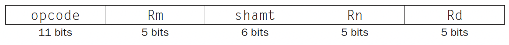
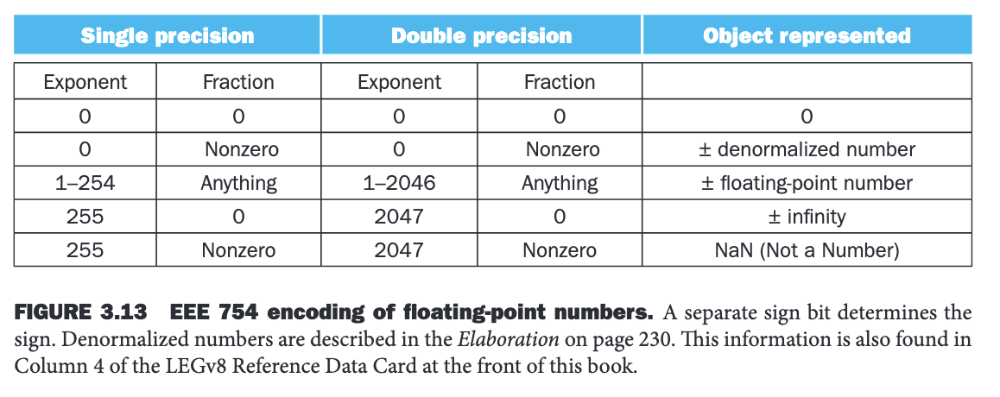
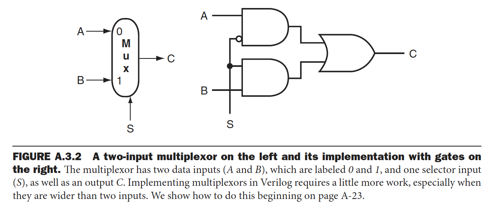

# EECS 370 Book Notes

## 1.1 Introduction


## 1.2 Eight Great Ideas in Computer Architecture

1. Design for Moore's Law - basically, when building computer architecture we will have to anticipate where the power of hardware will be when the project is finished. 
2. Abstraction - Hide unnecessary things from a user. Think of a "black box."
3. Make the Common Case Fast.
4. Performance via Parallelism.
5. Performance via Pipelining. 
6. Performance via Prediction. 
7. Hierarchy of Memories.
8. Dependability via Redundancy. 

## 1.3 Below your Program


There are many types of systems software, but two are critical for computers, an operating system and a compiler.

A operating system is the layer that communicates between software and hardware. Some of the important functions are handling basic input and output, allocating memory, protected sharing of the computer when multiple applications are being run at one time.

A compiler translates high-level programming languages into assembly.

### From a High-Level Language to the Language of Hardware

A 0 or 1 are referred to as a binary digit or bit. Instructions are just a collection of bits that the computer understands.

An *assembler* (a program that translates a symbolic version of instructions into the binary version) can translate `add A,B` into `1000110010100000` which in binary tells the compiler to add two numbers.

Binary is called *machine language*.

Here is an example of swapping two elements in an array. We first show the high-level in C, and then what it looks like in assembly. This is to show the level of abstraction at play.

Below is C:
```C
swap(int v[], int k)
{
    int temp;
    temp = v[k];
    v[k] = v[k+1];
    v[k+1] = temp;
}
```
Below is `asm`.

```asm
swap:
    multi $2, $5,4
    add $2, $4,$2
    lw $15, 0($2)
    lw $16, 4($2)
    sw $16, 0($2)
    sw $15, 4($2)
    jr $31
```

## 1.4 Under the Covers

A *bit map* is a matrix of bits. Pixels are matrices of bits.

Computer hardware for graphics consist mainly of a *raster refresh*, *buffer, or frame buffer* to store the bit map. The image represented onscreen is stored in the frame buffer, and bit pattern per pixel is read out to the graphics display at the refresh rate. The goal a but map is to represent what is on the screen.

The image below is a frame biffer with just 4 bits per pixel.


Each coordinate in the frame buffer determines the shade of the corresponding coordinate for the raster scan CRT display. Pixel $(X_0, Y_0)$ contains the bit pattern `0011`, which is a lighter shade than the pattern `1101` from pixel $(X_1, Y_1)$.

List of Definitions for Hardware:
* Integrated Circuit - Also called a chip. The chip contains millions of transistors usually.
* CPU - Also called a processor. The CPU contains the datapath and control, which adds numbers, test numbers, signals I/O devices to actives, and many other operations.
* Datapath - The component of the processor that performs arithmetic operations.
* Control - The component of the processor that commands the datapath, memory, and I/O devices according to the instructions of the program.
* Memory - The storage area in which programs are kept when they are running and that contains the data needed by the running programs.
* Dynamic Random Access Memory (DRAM) - Memory built as an integrated circuit (chip); it provides random access to any location. 
* Cache Memory - A small fast memory that acts as a buffer for a slower, larger memory.
* Static Random Access Memory (SRAM) - Also memory built as an integrated circuit, but faster and less dense than DRAM (SRAM is more expensive than DRAM).
* Instruction Set Architecture - This is simply referred to as architecture, but it provides an interface between the hardware and the lowest-level software.
* ABI (Application Binary Interface) - This is a combination of the basic instruction set and the operating system interface for application programmers.

An instruction set allows computer designers to talk about functions independently from the hardware that performs them. An example is talking about the function of a digital clock like keeping the time, and not thinking about the clock hardware like the LED display.

### A Safe Place for Data

When talking about a computer *volatile*, this means that when the power of a computer is shut off, all the data is lost. DRAM for example only retains data if the DRAM is receiving power.

*Nonvolatile memory* for example is like a DVD, the DVD doesn't forget what is stored on it when power is out. Nonvolatile memory is used when there is no power, and it is used to store programs between runs.

*Main memory* is also known as *primary memory*, is memory used to hold programs while they're running and is typically stored in the DRAM.

*Secondary memory* is nonvolatile memory used to store programs between runs; typically consists of flash memory or hard drives.

## 1.7 The Power Wall

The dominant technology for integrated circuits (chips) is called CMOS (complementary metal oxid semiconductor). The primary source of energy consumption is when the transistor switches from on (1) to off (0).

## Chapter 2 Instructions: Language of the Computer

## 2.2 Operations of the Computer Hardware

Every computer has the ability to perform arithmetic; the LEGv8 assembly language notation

```asm
Add a, b, c
```

instructs to computer to add the two variables `b` and `c`, and to put their sum in `a`. In each LEGv8 arithmetic instruction performs only one operation and must have exactly three values.

Suppose we want to have the sum of four variables `b`, `c`, `d`, and `e` into variable `a`. We would do the following sequence of instructions:

```asm
ADD a, b, c     // The sum of b and c is placed into a.
ADD a, a, d     // The sum of b, c, and d is now placed into a.
ADD a, a, e     // The sum of b, c, d, and e is now placed into a.
```


Let's show two quick examples from C to LEGv8.

First one, we will show the difference of executing two lines from C to LEGv8. We'll perform an addition operation and a subtraction operation.

```c
int main()
{
    a = b + c;
    d = a - e;
}
```
```asm
ADD a, b, c     // adding b and c, and storing it into a.
SUB d, a, e     // subtracting a from e and storing the result in d.
```

Now we will evaluate this complex expression from C to LEGv8.

```c
int main()
{
    f = (g + h) - (i + j);
}
```
```asm
ADD t0, g, h
ADD t1 i, j
SUB f, t0, t1
```

## Operands of the Computer Hardware

The operands of arithmetic instructions are restricted; they must be from a limited number of special locations built directly in hardware called *registers.* 

Registers are primitives in hardware design that are also visible to the programmer when the computer is completed. The size of a register in LEGv8 is 64 bits; groups of 64 bits occur so frequently that they are given the name *doubleword*. One major difference between variables of a programming language and registers is the limited number of registers, typically 32 on current computers like LEGv8.

### Register Example: Compiling a C assignment using registers

It's the compiler's job to assoicate program variables to register. The code from C:
```c
f = (g + h) - (i + j);
```
The variables `f,g,h,i,j` are assigned to registers `X19, X20, X21, X22, X23`. The compiled programmer is very similar to the code written in LEGv8 from the last example except the variable names are replaced with the registers. Note: `X9, X10` correspond to the variables `t0, t1`. 

Therefore, the code from c `f = (g + h) - (i + j);` turns into 

```asm 
ADD X9, X20, X21
ADD X10, X22, X23
SUB X19, X9, X10
```

### Memory Operands

Let's start this discussion with a definition, *data transfer instructions*, which is a command that moves data between memory and registers. Since we have only 32 of them in LEGv8 we need to reuse these registers for other uses.

To access a word (32 bit) or a doubleword, the instruction must supply the memory *address* (a value used to delineate the location of specific data elements within a memory array).

The data transfer instruction that copies data from memory to a register is traditionally called *load*. The format of the load instruction is the name of the operation followed by the register to be loaded, then register and a constant used to access memory. The sum of the constant portion of the instruction and the contents of the second register forms the memory address. The LEGv8 instruction for this is `LDUR` standing for *load register.*

### Example: Compiling an assignment when an operand is in memory.

Let's say that `A` is an array of 100 doublewords and the compiler has associated the variables `g` and `h` with the registers `X20` and `X21`. Let's also say that the starting address, or *base address*, of the array is `X22`. Compile the following C assignment statement:

```c
g = h + A[8]
```
To convert the following C code to LEGv8, we need must transfer `A[8]` to a register. The address of this array element is the sum of the base of the array `A`, found at register `X22` plus the number to select element 8. This data should be placed into a temporary register. In the code below, we put make `X9` the temporary register.

```asm
LDUR X9, [X22, #8]  \\ temporary register x9 gets A[8].
ADD X20, X21, X9 // g = h + A[8].
```

*Note:* `X22` is the base register, and the constant in a data transfer instruction `8` is called the offset.

Computers divide into those that use the address of the leftmost or "big end" buts as the doubleword address versus those that use the rightmost or "little end" byte. LEGv8 can work either as *big-endian* or *little-endian*. Since the order matters only if we access the identical data both as a doubleword and as eight bytes, few need to be aware of the "endianess."

Byte addressing also affects the array index. To get the proper byte address  in the code that we used for the example, *the offset to be added to the base register `X22` must be $8 \times 8$, or 64*, so that the load address will select `A[8]` and not `A[8/8]`.

The instruction to copy data from a register to memory is called *store*. The operation is similar to load as we put the operation name, followed by the register to be stored, then the base register, and finally the offset to select the array element. The LEGv8 command for store is `STUR`, standing for *store register*.


In the picture above, it stresses the idea of doublewords must start at addresses that are multiples of 8. This requirement is called *alignment restriction*.

### Example: Compiler using load and store

Assume variable `h` is associated with register `X21` and the base address of the array `A` is `X22`. What is the LEGv8 assemly code for the C assignment statement below?

```c
A[12] = h + A[8]
```

We first load the array from memory from base address `X22`, but we use the proper offset of byte addressing in the load register. Then we add, just like we did before. Now we store the sum into `A[12]`, using $8 \times 12 = 96$, as the offset and register `X22` to be the base register.

```asm
// first, load the array form memory into a temporary register.
LDUR X9, [X22, #64]
// perform the addition, and store into the same register.
ADD X9, X21, X1
// store the sum into base register X22 with offset of 96.
STUR X9, [X22, #96]
```

Many programs have more variables than the computer has registers so the compiler tries to keep the most frequently used variables in registers and place the rest in memory, using loads and stores to move variables between registers and memory. The process is called *spilling* registers. LEGv8 data transfer instruction only reads one operand or write one operand, without operating on it. Thus, registers take less time to access and have higher throughput than memory, making data in registers both considerably faster to access and simpler to use.

### Constant or Immediate Operands

MAny times a program will use a constant in an operation, for example incrementing an index to point to the next element of an array.

To add a constant 4 to register `X22`:

```asm
LDUR X9, [X20, AddrConstant4] // X( = constant 4)
ADD X22, X9, X22 // X22 = X9 + X22 (X9 == 4)
```

This is assuming that `X20 + AddrConstant4` is the memory address of the constant 4.

A way that would avoid load instructions is to offer versions of the arithmetic instructions in which one operand is a constant. This quick add instruction with one constant operand is called `add immediate` or `ADDI`. To add 4 to register X22:

```asm 
ADDI X22, X22, #4
```
*Note* `XZR` is hard-wired to be the value 0 and corresponds to register number 31.

## 2.4 Signed and Unsigned Numbers

To start off, let's look at the following equation:

$$d \times \text{Base}^i$$

$d$ is the digit, $i$ starts at 0 and increases right to left. Base is what base-system we are using. 

For example, $1011_{\text{two}}$ is:

$$(1 \times 2^3) + (0 \times 2^2) + (1 \times 2^1) + (1 \times 2^0) = 11$$


*Least significant bit* is used to refer to the rightmost bit (bit 0 above), and *most significant bit* to the leftmost bit (bit 63).

In binary, leading `0`s means positive, and leading `1`'s means negative.

Below is an image of positive and negative numbers:


All negative numbers have a 1 in the most significant bit (the right most). This is usually called the *sign bit* (right most bit).

### Example: Binary to Decimal Conversion

What is the decimal value of this 64-bit two;s complement number?

`11111111 11111111 11111111 11111111 11111111 11111111 11111111 11111100`

To answer this question, we will put the leading bit to be negative and the rest of the following bits positive because the first will evaluation to large negative number and the rest will be a large positive number leaving us with the negative result we want. 

$$(1 \times -2^{63}) + (1 \times 2^{62}) + (1 \times -2^{61}) + \cdots + (1 \times 2^1) + (0 \times 2^0)$$

$$ = -4$$

When loading a 64-bit doubleword into a 64-bit register, the signed and unsigned loads are identical. ARMv8 does offer two flavors of byte loads: *load byte,* `LDURB` treats the bute as an unsigned number and thus zero-extend to fill the leftmost bits of the register. *Load byte signed* `LDURSB` works with signed integers.

There is a short cut when working with complement numbers. First is to negate a two's complementary binary number, then add one to the result.

## 2.5 Representing Instructions in the Computer

Instructions are kept in the computer as a series of high and low electronic signals and may be represented as numbers. Each piece of an instruction can be considered as an individual number, and placing these numbers side by side forms the instruction. The 32 registers of LEGv8 are just referred to by their number, from 0 to 31.

### Example: Translating a LEGv8 Assembly Instruction into a Machine Instruction

We'll show the LEGv8 language version of instruction represented below as a combination of decimal numbers and then binary numbers.

```asm
ADD X9, X20, X21
```
The decimal numbers are show below:

$$\fbox{1112}\fbox{21}\fbox{0}\fbox{20}\fbox{9}$$


Each of the segments of the instruction is called a *field*. The first field $\fbox{1112}$ tells the LEGv8 computer that this instruction performs addition. The second field gives the number of the register that is second source operand for the addition (20 for `X20`). Each of the decimal numbers like 9 correspond with the register number like `X9` (register number corresponds to decimal number without `X` in front). The third field is $\fbox{0}$ because it is unused. Each field corresponds to the binary numbers in the image below:


This layout of the instruction is called the *instruction format*. We can see that the bits add up to 32 bits (that is why 0 is 6 bits).

We will use hexadecimal (base 16) to read binary numbers. As base 16 is a power of 2, we can convert by replacing each group of binary digits by a single hexadecimal digit.

### Example: Binary to Hexadecimal and Back

Covert the following 8-digit hexadecimal and 32-bit binary numbers into other base:

```
eca8 6420 (base-hex)
0001 0011 0101 0111 1001 1011 1101 1111 (base-two)
```
Let's solve the hex first. We will break down each number into a four bit groups.
```
eca8 6420
1110 1100 1010 1000 0110 0100 0010 0000
```

The other, we will convert each four chunk into hex:

```
0001 0011 0101 0111 1001 1011 1101 1111 (base-two)
1357 9bdf
```

### LEGv8 Fields



Below is the fields in LEGv8 instructions:

* opcode: Basic operation of the instruction, and this abbreviation is
* Rm: The second register source operand.
* shamt: Shift amount.
* Rn: The first register source operand.
* Rd: The register designation operand. It gets the result of the operation.

### Example: translating LEGv8 Assembly Language into Machine Language

If `X10` has the base of the array `A` and `X21` corresponds to `h`. What is the C code to LEGv8?

```c
A[30] = h + A[30] + 1;
```

```
LDUR X9 [X10, #240] // load in A[30] to X9
ADD X9, X21, X9 // h + A[30]
ADDI X9, X9, #1 // h + A[30] + 1
STUR X9 [X10, #240] // stores h + A[30] + 1 back into A[30]
```
## 2.6 Logical Operations


The table above is a list of bit operations. 

To bit shift left or right in LEGv8, there is a shift instructions for it! *Logical shift left* is denoted at `LSL`, and *logical shift right* is denoted as `LSR`

Lets look at simple example of bit shifting in LEGv8:

```asm
LSL X11, X19, #4 // X11 = X19 << 4 bits
```

What the code block above is saying is we take register 19 shift it left 4 bits and store the result in register 11.

Shifting is known as the *shamt* field in the R-format. Here is what the code block looks like in R-format:


## 2.7 Instructions for Making Decisions

LEGv8 have two conditional statements that are equivalent to `if` and `goto`.

The first instruction
```asm
CBZ register, L1
```
means go to the statement labeled `L1` if the value in `register` equals zero. `CBZ` means *compare and branch if zero.* 

The second instruction is 
```asm
CBNZ register, L1
```
it means go to the staatment labeled `L1` if the value in   `register` *does not* equal zero. `CBNZ` stands for *compare and branch if not zero.* These two statements are the conditional branches.

### Example: Compiling if-then-else Conditional Branches.

In this examples `f,g,h,i,j` variables correspond to the five registers `X19-X23`. What is the translation from C to LEGv8 of the following C code?

```c
if(i == j)
{
    f = g + h;
}
else
{
    f = g - h;
}
```

```asm
// f == X19
// g == X20
// h == X21
// i == X22
// j == X23
SUB X9, X22, X23 // Need to see if the difference between i and j is 0
CBNZ X9, Else // If i != j go to Else 
ADD X19, X20, X21
B Exit // go to Exit
Else:SUB X19, X20, X21 // f = g- h (skipped if i = j)
Exit:
```

We see that we do `CBNZ` rather than `CBZ`. We do this because its more efficient to test the opposite condition to branch over.

`B Exit` is called the *unconditional branch*. This instruction says that the processor always follows the branch. `B` will be used for the instruction branch.

### Loops

We will start with an example!

### Example: Compiling a `while` Loop in C

```c
while(save[i] == k)
{
    i += 1;
}
```

To translate this into LEGv8, first we will assume `i == X22, j == X23, k == X24` (`==` meaning corresponds). The first step is to load `save[i]` into a temporary register, but before we can load `save[i]` into a temporary register, we need to have its address, before we can add `i` to the base of array `save` to form the address, we must multiply the index `i` by 8 due tto the byte addressing issue. Fortunately, we can shift left by 3. We need to add the label `Loop` to it so that we can branch back to that instruction at the end of the loop:

```asm
Loop: LSL X10, X22, #3  // Temp regX10 = i * 8
```

To get the address of `save[i]`, we need to add `X10` and the base of save in `X25`:
```asm
ADD X10, X10, X25   // X10 = address of save[i]
```
Now we can use that address to load `save[i]` into a temporary register:

```asm
LDUR X9, [X10, #0] // Temp reg X9 = save[i]
```
Next we subtract `k` from `save[i]` and put the difference into `X11` to set up the loop test. If `X11` is not 0, then they are unequal:
```asm
SUB X11, X9, X24    // X11 = save[i] - k
```
Next step is to perform a loop test exiting if `save[i] != k`
```asm
CBNZ X11, Exit
```
The following instruction adds 1 to `i`:
```asm
ADDI X22, X22, #1   // i = i + 1
```
The end of the loop branches back to the `while` test at the top of the loop. We just add the `Exit` label after it and we're done:
```asm
B Loop  // go to Loop
Exit:
```
Now we will alk about *condition codes* or *flags*. Condition codes help determine what the logical operator is doing and how it will be handled with lower level systems. The condition codes are named:
* Negative (N) - the result that set the condition code had a 1 in the most significant bit.
* zero (Z) - the result that set the condition code was 0.
* overflow (V) - the result that set the condition code overflowed.
* carry (C) - the result that set the condition code had a carry out o the most significant bit or a borrow into the most significant bit.

In LEGv8, the condition branch instruction `B.cond. cond.` can be used for any of the signed comparison instructions:
* `EQ`, equal
* `NE`, not equal
* `LT`, less than
* `LE`, less than or equal
* `GT`, greater than
* `GE` greater than or equal

Here is a chart that is for the combination of these condition branches:


### Bounds Check Shortcut

### Example:

Use a shortcut to reduce an index-out-of-bounds check: branch to `IndexOutOfBounds` if `X20` $\ge$ `X11` or if `X20` is negative.

To answer this we will start by checking code using unsigned greater than or equal to do both checks:

```asm
SUBS XZR, X20, X11  // Test if X20 >= length or X2- < 0
B.HS IndexOutOfBounds   // if bad, goto Error
```

## 2.8 Supporting Procedures in Computer Hardware 

A procedure is a function in programming. For LEGv8 we have the following convention for procedure calling allocating its 32 registers:
* `X0 - X7`: eight parameter registers in which to pass parameters or return values.
* `LR (X30)`: one return address register to return to the point of origin.

The *branch-and-link instruction* `BL` is written as 

```asm
BL ProcedureAddress
```

The link portion of the name means that na address or link is formed that points to the calling site to allow the procedure to return to the proper address. This link is stored in `LR` (register 30), and this is called the *return address*.

The branch register branches to the address store in register `LR` which is what we want. The *caller* is calling the program. The *caller* puts the parameters in `X0-X7` and uses `BL X` to branch to procedure `X` (and this is referenced as the *callee*). The *callee* performs the calculations and places the result in the same parameter register and returns control back to the caller using `BR LR`. When doing this calling the PC (program counter) is saved in `LR` for a return address.

### Using More Registers

We will use the *stack* for spilling registers. A stack needs a pointer to the most recent allocated address in the stack to show where the next procedure should place the register to be spilled or where old register values are found. The *stack pointer* `SP` which is just one of the 32 registers, is adjusted by a one double word for each register that is saved or restored. Stacks frow from higher address to lower addresses. This convection means that you push values onto the stack by subtracting from the stack pointer.

### Example: Lets turn a C Procedure that doesn't call another procedure.

```c
long long int leaf_example (long long int g, long long int h, long long int i, long long int j)
{
    long long int f;
    f = (g + h) − (i + j);
    return f;
}
```

To turn this into LEGv8 code we must turn the parameters into registers. Let `g, h , i, j` correspond to `X0, X1, X2, X3` and `X19` will be `f`.

The program will start with the label of the procedure:

```asm
leaf_example:
SUBI SP, SP, #24         ; Adjust stack to make room for 3 items
STUR X10, [SP, #16]     ; save register X10 for use afterwards.
STUR X9,  [SP, #8]      ; Save register X9 for use afterwards.
STUR X19, [SP, #0]      ; Save register X19 for use afterwards.
```
Now these three statements correspond to the body of the procedure (the function).

```asm
ADD X9, X0, X1          ; register X9 contains g + h
ADD X10, X2, X3         ; register X10 contains i + j
SUB X19, X9, X10        ; f = (g+h) - (i+j)
```

We return the value of `f` by coping it into the parameter register.

```asm
ADD X0, X19, XZR        ; returns f(X0 = X19 + 0)
```
Before returning, we restore the three old values of the registers we saved by "popping" them off the stack:

```asm
LDUR X19, [SP, #0]      ; restore register X19 for caller.
LDUR X9, [SP #8]        ; restore X9 for caller.
LDUR X10, [SP, #16]     ; restore register X10 for caller.
ADDI SP, SP, #24        ; adjust stack to delete three items.
```

The procedue ends with a branch register using the return address:

```asm
BR  LR                  ; branch back to calling routine.
```
 LEGv8 uses two groups for the registers:
* `X9 - X17`: temporary registers that are not preserved by the callee on a procedure call.
* `X19 - X28`: saved registers that must be preserved on a procedure call (if used, the callee saves and restores them).

Here is the complete example:

```asm
leaf_example:
    SUBI SP,SP,#24
    STUR X10,[SP,#16]
    STUR X9,[SP,#8]
    STUR X19,[SP,#0]
    ADD X9,X0,X1
    ADD X10,X2,X3
    SUB X19,X9,X10
    ADD X0,X19,XZR
    LDUR X10,[SP,#16]
    LDUR X9,[SP,#8]
    LDUR X19,[SP,#0]
    ADDI SP,SP,#24
    BR LR
```


### Nested Procedures

Procedures that do not call others are called leaf procedures.

### Example Compiling a recursive C procedure, showing nested procedure and linking

```c
long long int fact (long long int n)
{
    if (n < 1) return (1);
    else return (n * fact(n − 1));
}
```

Lets convert this C code to LEGv8.

`n` corresponds to the argument of register `X0`. The compiled program starts with the label of the procedure and then saves two registers on the stack, the return address and `X0`.

```asm
fact:
    SUBI SP, SP, #16        ; giving the stack space for two items.
    STUR LR, [SP, #8]       ; save the return address.
    STUR X0, [SP #0]        ; save the return argument n.
```

The first time `fact` is called, `STUR` saves an address in the program that called `fact`. The next two instructions test wheather `n` is ness than 1, going to `L1` if `n >=1 `.

```asm
    SUBIS   ZXR, X0, #1     ; test for n < 1.
    B.GE    L1              ; if n >= 1, go to L1.
```

If `n` is less than 1, `fact` returns 1 into a value register: it adds 1 into 0, and places that sum into `X1`. It them pops the two saved values off the stack ad branches to the saved return address:

```asm
    ADDI    X1, XZR, #1    ; RETURN 1
    ADDI    SP, SP, #16    ; POP 2 ITEMS OFF THE STACK
    BR      LR             ; RETURN TO CALLER.
```


Here is the complete example:

```asm
fact:
    SUBI SP,SP,#16          ; MAKES SPACE FOR STACK
    STUR LR,[SP,#8]         ; MAKING SPACE OF THE RETURN VALUE
    STUR X0,[SP,#0]         ; MAKING SPACE FOR N
    SUBIS XZR,X0,#1         ; COMPARE N AND 1
    B.GE L1                 ; IF N >= 1, GO TO L1
    ADDI X1,XZR,#1          ; ELSE, SET RETURN VALUE TO 1
    ADDI SP,SP,#16          ; POP STACK (NOT RESTORING VALUES)
    BR LR                   ; RETURN
L1: SUBI X0,X0,#1           ; N = N-1
    BL fact                 ; CALL FUNC(N-1)
    LDUR X0,[SP,#0]         ; RESTORE CALLER'S N
    LDUR LR,[SP,#8]         ; RESTORE CALLER'S RETURN ADDRESS
    ADDI SP,SP,#16          ; POP STACK
    MUL X1,X0,X1            ; RETURN N * N - 1
    BR LR                   ; RETURN
```

### Allocating Space for New Data on the Stack

The final complexity is that the stack is also used to store valriables that are local to the procedure, but do not fit in registers like local arrays or structures. The segement of the stack containing a procedure's saved register and local variables is called a *procdeure frame* or *activation record*.

Some ARMv8 compilers use a *frame pointer* `FP` to point to the first doubleword of the frame procedure. A stack pointer might change during the procedure, and so references to a local variable in memory that might have different offsets depending on where they are in the procedure. 


### Allocating Space for New Data on the Heap

In the image below we see how dynamic memory is on the heap. With a lanugae like C or C++, when we want dynamic memory we would use the keywords like `malloc()` in C and `new` in C++. 

The `Text` section on the diagram is machine code on a UNIX system for routines in the srouce file. The *static data* section is where static variables are placed. The stack grows downward while the heap grows upwards!


## 2.12 Translating and Starting a Program


### Assembler

When the we write code in LEGv8 some instructions are translated into the machine language equivalent. For example:

```asm
MOV X9, X10             ; REGISTER X9 GETS REGISTER X10
ORR X9, XZR, X10        ; REGISTER X9 GETS 0 OR REGISTER X10.
```

The LEGv8 assembler aso converts `CMP` (compare) into a subtraction instruction that sets the condition codes and has `XZR` as the destination. 

```
CMP X9, X10             ; COMPARES X9 TO X10 AND SET CONDITION CODES
SUBS XZR, X9, X19       ; USE X9 - X10 TO SET THE CONDITION CODES.
```

Note that a symbol table is used to keep track of labels that are in the assembly code. 

The object file for UNIX systems are typically contains six distinct pieces:
1. The *object file header* describes the sie and position of the other pieces of the object file.
2. The text segment contains the machine language code.
3. The *static data segment* contains data allocated for the life of the program.
4. The *relocation information* identifies instructions and data words that depend on absolute address when the program is loaded into memory.
5. The *symbol table* contains the remaining labels that are not defined, such as external references.
6. *Debugger information* contains a concise description of how the modules were compiled so that a debugger can associate machine instructions with C source files and make data structures readable.

### Linker

A *link editor* or *linker*, takes all the independently assembled machine language programs and "Stitches" them together. The reason a linker is useful is that it is much faster to patch code than it is to recompile and reassemble. There are three steps to a linker:

1. Place code and data modules symbolically in memory.
2. Determine the addresses of data and instruction labels.
3. Patch both the internal and external references.

The linker uses the relocation information and symbol table in each object module to resolve all undefined bales.

If all external references are resolved, the linker will now determine the memory locations each module will occupy. 

The linker produces an *executable file* that can be run on a computer. Typically this is the same format as the object file, except that it contains no unresolved references.

### Loader

Now that the executable is on disk, the operating system reads it to memory and starts it. The *loader* follows these steps in UNIX systems:

*Note:* A loader is a systems program that places an object program in main memory so that it is ready to execute.

1. Reads the executable file header to determine size of the text and data segments.
2. Creates as address space large enough for the text and data.
3. Copies the instructions and data from executable file into memory.
4. Copies the parameters (if any) to the main program onto the stack.
5. Initializes the processor registers and sets the stack pointer to the first free location.
6. Branches to start-up routine and copies the parameters into the argument registers and calls the main routine of the program. When the main routine returns, the start-up routine terminates the program and an `exit` system call.

### Dynamically Linked Libraries

A Dynamically linked library is a library routine that are linked during the programs execution. They are a good alternative to static linked libraries because when there is an update to the library it applies to it. They do require more storage than a static library, because of their dynamic linking, but do not require the whole libraries to be copies.


# Arithmetic for Computers

## Addition and Subtraction

The big questions dealing with overflow is when it occurs. Adding and subtracting 64-bit numbers can results in overflow because the result might need a 64-bit number.


Some languages like Java or C just ignore overflows.

## 3.3 Multiplication

When we see $1000 \times 2000$, $1000$ is called the multiplicand, and $2000$ is called the multiplier; the final result is called the product.


We first assume that the multiplier ($2000$) is a 64-bit register and that 128-bit Product register is initialized to 0. Over 64 steps the 64-bit multiplicand ($1000$) would move 64-bits to the left. Therefore, we need a 126-bit multiplicand register, initialized with the 64-bit multiplicand in the right half and zeros in the left half. This register is then shifted left 1 bit each step to align the multiplicand with the sum being accumulated in the 128-bit register.

In the diagram above, the least significant bit of the multiplier ($2000$ in the example) determines whether the multiplicand is added to the Product register. Step 2 does a left shift to move the intermediate operands to the left. Step 3 is the right shift gives us the next bit of the multiplier to examine the following iteration. These steps are then repeated 64 times to get the product.


## 3.5 Floating Point

A floating-point number is usually a multiple of the size of a word (32-bit). The LEGv8 floating-point number is shown below, where $s$ is the sign (1 meaning negative), exponent is the value of the 8-bit exponent field (including the sign of the exponent), and fraction is the 23-bit number/

The general form for a floating-point number is:

$$(-1)^s \times F \times E$$

$F$ is the fraction, $E$ is the exponent.


When we take about overflow, this means that the exponent is too large to be represented in the exponent field.

There is also something called underflow, and this is when a values negative exponent is too large to fit in the exponent field.

This lets us talk about single and double precision. Single precision like `float` in C is a floating-point values that is a 32-bit word. While double precision, `double` in C, is 64-bits, also known as a double word.

For double precision the fields are larger! Exponent is 11 bits, fraction is a 52 bits, while the sign still will only take 1 bit.


### IEEE 754 Floating-Point Standard

The IEEE standard is on every computer since 1980!

To pack more bits into a number, IEEE 754 makes the leading 1 bit of normalized binary numbers implicit. This makes a 24 bit long in precision (implied 1 and a 23-bit fraction), and a 53 bits long in double precision (1 + 52). To be precise, we use the term significant to represent the 24 or 53-bit number that is 1 plus the fraction. Fraction is when the 23 or 52 bit number. Since 0 has no leading 1, it is given the reserved exponent value 0 so that the hardware won't attach a leading 1 to it.

When we see $00\dots00_{two}$ represents 0, the representation of the rest of the numbers uses the form from before with the hidden 1 added:

$$(-1)^s \times (1 + \text{Fraction}) \times 2^E$$

where the bits of the fraction represent a number between 0 and 1 and E specifies the value in the exponent field. If we number the bits of the fraction from left to right s1, s2, s3, ..., then the value is 

$$(-1)^s \times (1 + (s1 \times 2^{-1}) + (s2 \times 2^{-2}) + (s3 \times 2^{-3}) + \dots ) \times 2^{E}$$



Biased notation will help us with negative exponents. With biased notation, with the bias being the number subtracted form the normal, unsigned representation to determine the real value.

IEEE 754 uses a bias of 127 for single precision, so an exponent of -1 is represented by the bit pattern of the value $-1 + 127_{\text{ten}}$, or $126_{\text{ten}} = 0111 \space 1110_{\text{two}}$, and +1 is represented by 1 + 127, or $128_{\text{ten}} = 1000 \space 0000_{\text{two}}$. The exponent bias for double precision is 1023. Biased exponent means that the value represented by a floating-point number is really

$$(-1)^s \times (1 + \text{Fraction}) \times 2^{\text{Exponent - Bias}} $$

## A.3 Combinational Logic

*Note:* I have skipped A.2 Because it talks about gates, truth tables, and logical equations which have been covered in EECS 203 to some extent (when I took it).

### Decoders

A decoder is a logic block that has a $n$-bit input and $2^n$ outputs, where only one output is asserted for each input combination.

If the value of input is $i$then Out$i$ will be true and all other outputs will be false.

In the image below we have a 3-bit decoder. This decoder is called a *3-to-8 decoder* since there are three inputs and eight ($2^3$) outputs. There is also a logic element called an encoder that performs the inverse function of a decoder, taking $2^n$ inputs and producing an $n$-bit output.


### Multiplexors

A multiplexor might also be called a *selector*, since its output is one of the inputs that is selected by a control.

Before we dive into more about a selector lets review a definition called the *selector value*. The *selector value* also know as the *control value*, the control signal that is used to select one of the input values of a multiplexor as the output of the multiplexor.

In the image below we will consider the two-input multiplexor. The multiplexor has three inputs, two data values $A$ and $B$, and a selector $S$. The selector value determines which of the inputs becomes the output. We can represent the logic function computed by a two-input multiplexor as:

$$C = (A \cdot S) + (B \cdot S).$$



Multiplexor can be created with an arbitrary number of data inputs. When there are only two inputs, the selector is a single signal that selects one of the inputs if it's true (if it's 1) and the other if it's false (0). If there are $n$ data inputs, there will need to be $|\log_2(n)|$ selector inputs.

Multiplexor basically consists of three parts:

1. A decoder that generates $n$ signals, each indicating a different input value.
2. An array of $n$ AND gates each combining one of the inputs with a signal for the decoder.
3. A single large OR gate that incorporates the outputs of the AND gates.

### Two-Level Logic and PLAs

*Sum of Products* A form of logical representation that employs a logical sum (OR) of products (terms joined using the AND operator). A product of sums is just the opposite.

$$E = (A \cdot B \cdot \bar{C}) + (A \cdot C \cdot \bar{B}) + (B \cdot C \cdot \bar{A})$$

This equation above is the sum of products.

$E$ can be also written as a product of sums:

$$E = \overline{(\bar{A} + \bar{B} + C) \cdot (\bar{A} + \bar{C} + B) \cdot (\bar{B} + \bar{C} + A)}$$