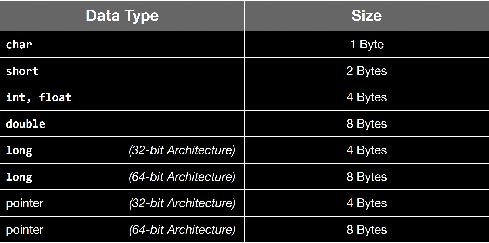
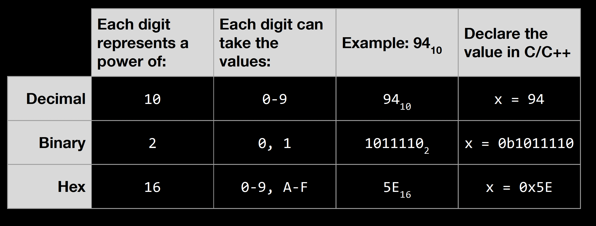

# EECS 370 Discussion Notes

## Discussion 1:

The "translations" from C++ to C:

|C++|C|
|:--|:--|
|`new`, `delete`|`malloc()`, `free()`|
|`std::string`|`char*`, `strcmp()`, `strcpy()`|
|`std::vector, std::set, std::map`|Only arrays|
|`std::cout, std::cin, std::fstream`|`printf(), scanf(), fopen(), fgets()`|

*Note:* To make a string in C, we will use a different syntax. This is displayed in the example below:

```c
#include <stdio.h>

int main(void)
{
    char *cstring = "Hello World";
    printf("%s\n", cstring);
    return 0;
}
```

### The Size of Common Data Types



Below is a chart of primitive types. As a reminder, primitive types are types that are given to the programmer by the language; they are not defined by the programmer.

### Decimal, Binary, and Hexadecimal in C

C doesn't have `bool` types. To include `bool` types we need to include `#include <stdbool.h>`. We usually use `int` instead.

Any `_t` data type like `uint32_t` are in `#include <stdint.h>`.

### Strings in C and C++

When we are messing around with strings in C we need to think about them as just a `char` array. In C, when we say `char* hello = "Hello there";`, `hello` is just a pointer to the first character in the array:

$$
\overbrace{\fbox{H}}\fbox{e}\fbox{l}\fbox{l}\fbox{o}\fbox{/0}
$$

Where the brace is, this is where `hello` is pointing to. To actually copy two strings we would do the following.

```c
#include <stdio.h>
// need to include to get string functions.
#include <string.h>

int main(void)
{
    char* hello = "Hello World!";
    // allocate space for jello.
    char jello[strlen(hello) + 1];
    // dst, org
    strcpy(jello, hello);
    jello[0] = 'J';
    printf("%s\n", jello);
    return 0;
}
```

In the code above we want to have the string `jello` to say `Jello World!`. To do this we need to allocate space for `jello`, if we don't then we when are calling `strcpy()`, this function will segfault because there is no space to put the copy of `hello`. To allocate the correct size of the space needed we will call another `<string.h>` function called `strlen()` which gets the size of the string. We add `1` to this for the null terminating character `\0`.

### C Strings and Structs

Let's look at the two structs below:

```c
#include <stdio.h>
#include <string.h>

// first.
struct double_string_ptrs
{
    char *a;
    char *b;
};
// second.
struct double_string_char_arrs
{
    char a[80];
    char b[80];
};

int main(void)
{
    struct double_string_ptrs ptrs;
    ptrs.a = "hi";
    ptrs.b = "there";

    struct double_string_char_arrs arrs;
    strcpy(arrs.a, "hello");
    strcpy(arrs.b, "awesome");

    return 0;
}
```

The first struct `double_string_ptrs` contains only pointers, so the actual C-strings are elsewhere. So the struct can go out of scope before or after the C-strings.

The second struct, `double_string_char_arrs` contains actual C-strings, so when the struct goes out of scope, so do the C-strings!

### `printf()` and `fprintf()`

`printf()` and `fprintf()` use formatted strings to produce output. The formatted string is then followed by the ordered list of values to insert.

Formatted strings contain *format specifiers* to insert useful values into output and these specifiers begin with %:

* %c: character
* %s: string (null-terminated)
* %d: decimal number.
* %x: hexadecimal number (great for P1a debugging)

### Basics of Decimal, Binary, and Hexadecimal

When we are looking at C-code, `0b` tells the compiler that this is a binary number of base 2.

```c
#include <stdio.h>

int main(void)
{
    int num = 0b0011;
    printf("%d\n", num); // prints 3.
    return 0;
}
```

### Decimal to Hexadecimal

*Hexadecimal (Hex)* is a number system based on the number sixteen.



An example of a decimal number 94 in hex is `5E` because `E` cooresponds to 15. To get this answer first we divide 94 by the base which is 16 until the quotient is 0.

$$
\frac{94}{16} = 5 \text{ with a remainder of 14.} \\
\qquad 
\frac{5}{16} = 0 \text{ with a remainder of 5.} \\
\therefore  5 \text{ corresponds with 5, and 14 corresponds to E.}
$$

This concludes that 94 in hex is `5E`.

The values of Hex for 94 is $16^1 16^0$, and coverting hex back to decimal is we take the remainder and multiply it by its associated value. So to get back `5E` back to 94:

$$
5E = 5 \cdot16^1 + 14 * 16^0 = \boxed{94.}
$$

### Binary to Hex

Below this is a simple algorithm to convert a binary number to a hexadecimal number.

First, split the binary number into groups of four. Second, convert those groups of from binary to a decimal number. Third, from these numbers we now convert them to hexadecimal. 

*Note* if we cannot split up the binary number into four chunks, just add zeros the the left most group. Look at the example below:

$$
\boxed{1}\boxed{0}\boxed{1}\boxed{1}\boxed{1}\boxed{0}\boxed{1}\boxed{0}\boxed{1}\boxed{0}
\newline \text{Group into fours} \newline
\boxed{1}\boxed{0} \qquad \boxed{1}\boxed{1}\boxed{1}\boxed{0} \qquad \boxed{1}\boxed{0}\boxed{1}\boxed{0}
\newline \text{Now add zero to the left most group} \newline
\boxed{0}\boxed{0}\boxed{1}\boxed{0} \qquad \boxed{1}\boxed{1}\boxed{1}\boxed{0} \qquad \boxed{1}\boxed{0}\boxed{1}\boxed{0}
\newline \text{Convert groups into decimal} \newline
\underbrace{\boxed{0}\boxed{0}\boxed{1}\boxed{0}}_{2} \qquad \underbrace{\boxed{1}\boxed{1}\boxed{1}\boxed{0}}_{14} \qquad \underbrace{\boxed{1}\boxed{0}\boxed{1}\boxed{0}}_{10}
\newline \text{Convert decimal to hexadecimal} \newline
2 \rightarrow 2, \qquad 14\to E, \qquad 10 \to A
$$

Therefore, the binary number $\boxed{1}\boxed{0}\boxed{1}\boxed{1}\boxed{1}\boxed{0}\boxed{1}\boxed{0}\boxed{1}\boxed{0}$ converts to `2EA`

### Hexadecimal to Decimal

Let's look at the example of `1EFC` converted to decimal:

First, each position is $16^{\text{placement}}$, and what we mean by placement is what spot it is (remember, we start at zero). For the example `1EFC`, 1 is at spot $3$ which means it would be $16^3$. Second, we multiply this base placement combo by the hex number that is in that spot, in this case $1$.

$$
1EFC \to 1\cdot16^3 + 14 \cdot 16^2 + 15 \cdot 16^1 + 12 * 16^0 = 4096 + 3584 + 240 + 12 = \boxed{7932.}
$$

<!-- Show example of C using hex numbers and how to print it -->
<!-- Addition in Decimal and Binary -->
<!-- Bit shifts -->
<!-- Bit & -->
<!-- Bit | -->
<!-- Problem 2 -->
<!-- Problem 3 -->


